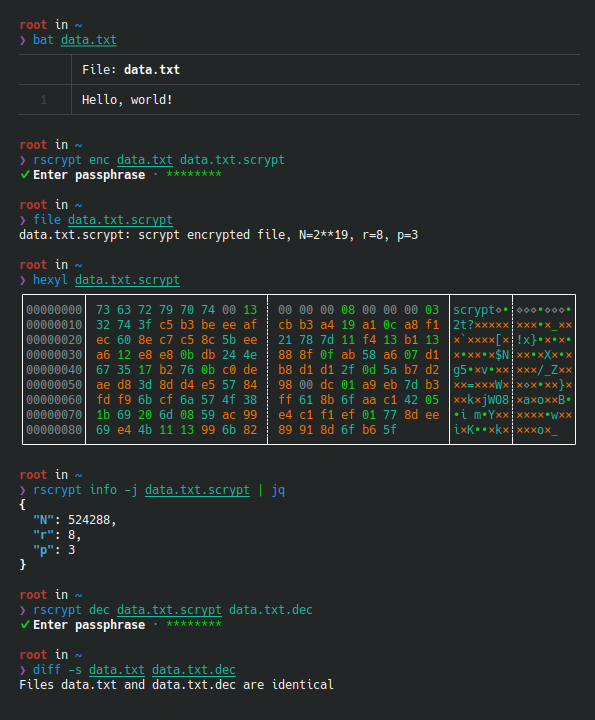

// SPDX-FileCopyrightText: 2024 Shun Sakai
//
// SPDX-License-Identifier: Apache-2.0 OR MIT

= scryptenc-rs
:github-url: https://github.com
:project-url: {github-url}/sorairolake/scryptenc-rs
:shields-url: https://img.shields.io
:crates-io-url: https://crates.io
:crates-io-crates: {crates-io-url}/crates
:npm-url: https://www.npmjs.com
:npm-package: {npm-url}/package
:ci-badge: {shields-url}/github/actions/workflow/status/sorairolake/scryptenc-rs/CI.yaml?branch=develop&style=for-the-badge&logo=github&label=CI
:ci-url: {project-url}/actions?query=branch%3Adevelop+workflow%3ACI++
:format-spec-url: {github-url}/Tarsnap/scrypt/blob/1.3.1/FORMAT
:scryptenc-repo-url: {project-url}/tree/develop/crates/scryptenc
:scryptenc-badge: {shields-url}/crates/v/scryptenc?style=for-the-badge&logo=rust
:scryptenc-crates-io: {crates-io-crates}/scryptenc
:scryptenc-cli-repo-url: {project-url}/tree/develop/crates/cli
:scryptenc-cli-badge: {shields-url}/crates/v/scryptenc-cli?style=for-the-badge&logo=rust
:scryptenc-cli-crates-io: {crates-io-crates}/scryptenc-cli
:scryptenc-wasm-repo-url: {project-url}/tree/develop/crates/wasm
:scryptenc-wasm-badge: {shields-url}/npm/v/%40sorairolake%2Fscryptenc-wasm?style=for-the-badge&logo=npm
:scryptenc-wasm-npm: {npm-package}/@sorairolake/scryptenc-wasm
:reuse-spec-url: https://reuse.software/spec/

image:{ci-badge}[CI,link={ci-url}]

*scryptenc-rs* is a file encryption tool and Rust library which implements the
{format-spec-url}[scrypt encrypted data format].

== Crates

|===
|Name |Version |Description

|{scryptenc-repo-url}[`scryptenc`]
|image:{scryptenc-badge}[Version,link={scryptenc-crates-io}]
|An implementation of the scrypt encrypted data format.

|{scryptenc-cli-repo-url}[`scryptenc-cli`]
|image:{scryptenc-cli-badge}[Version,link={scryptenc-cli-crates-io}]
|File encryption tool using the scrypt encrypted data format.

|{scryptenc-wasm-repo-url}[`scryptenc-wasm`]
|image:{scryptenc-wasm-badge}[Version,link={scryptenc-wasm-npm}]
|Wasm bindings for scryptenc.
|===

== Source code

The upstream repository is available at
https://github.com/sorairolake/scryptenc-rs.git.

.The source code is also available at
* https://gitlab.com/sorairolake/scryptenc-rs.git
* https://codeberg.org/sorairolake/scryptenc-rs.git

== Contributing

Please see link:CONTRIBUTING.adoc[].

== License

Copyright (C) 2022&ndash;2024 Shun Sakai (see link:AUTHORS.adoc[])

. Unless otherwise noted, each file is distributed under the terms of either
  the _Apache License 2.0_ or the _MIT License_.
. Each file in the `crates/cli` directory and some other files are distributed
  under the terms of the _GNU General Public License v3.0 or later_.
. Some documents are distributed under the terms of the _Creative Commons
  Attribution 4.0 International Public License_.

This project is compliant with version 3.2 of the
{reuse-spec-url}[_REUSE Specification_]. See copyright notices of individual
files for more details on copyright and licensing information.
